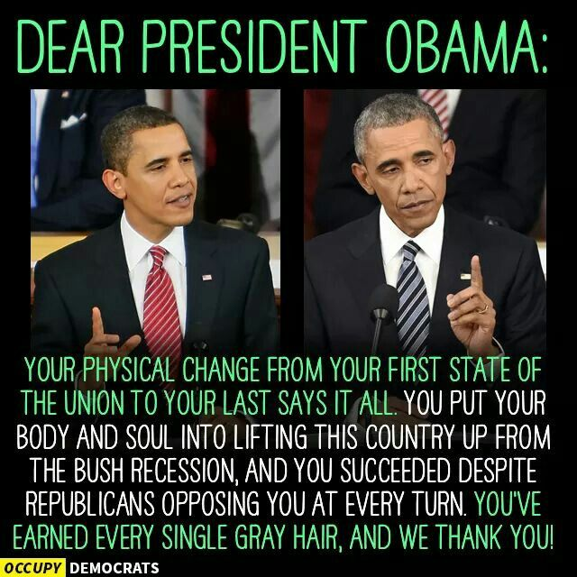

```{r setup, include=FALSE}
knitr::opts_chunk$set(echo = TRUE)
```

# What's the difference between inauguration and farewell speech?


The president election is always a popular topic among our daily life. It is like a big show happens every four years. 

We not only cares about the nominators' life experience and their personalities, we also cares about what they will say during public speeches. After all, delivering public speeches is the most direct and effective way to communicate with people for nominators.

The speeches mainly serve for three purposes:

1. Describe the plans and blueprints for the future

2. Tell the public What he/she cares about for the society

3. Resonate with the public both emotionally and logically 


Based on these three points, I am trying to analyze the speeches with sentiment analysis and topic model. 

##### A deeper thinking about the president speech
Compared to the nomination speeches, I am more interested in the inauguration speech and farewell speech. Why? 

The inauguration speech indicates the beginning of a president's career, usually the speech focus on the plans and passions for the future; while the farewell speech is more like a summary of a president's career, the speech focus on the achievements and hopes for the future. 

I am curious about whether the presidents have kept their promises and how their working focus changed over his career.

```{r, echo=FALSE, fig.align='center', message=FALSE, warning=FALSE, out.width="400px"}

```

Therefore, I will compare the inauguration speech and farewell speech of the same president to get some insights out of those words. 

### Data and necessary packages loading


```{r load libraries, message=FALSE, warning=FALSE}
setwd("C:/Hongjie/5243 Applied Data Science/fall2017-project1-HongjieRen-master/fall2017-project1-HongjieRen-master/doc")
packages.used=c("rvest", "beeswarm", "factoextra", 
                "sentimentr", "qdap","gplots", "dplyr",
                "tm", "syuzhet", "scales", "RColorBrewer",
                "RANN", "tm","DT","languageR","NLP","openNLP","magrittr","ggplot2","tidytext","wordcloud","grid","gridExtra","knitr")

# check packages that need to be installed.
packages.needed=setdiff(packages.used, 
                        intersect(installed.packages()[,1], 
                                  packages.used))
# install additional packages
if(length(packages.needed)>0){
  install.packages(packages.needed, dependencies = TRUE)
}

# load packages
library("rvest")
#library("qdap")
library("sentimentr")
library("gplots")
library("dplyr")
library("tm")
library("syuzhet")
library("scales")
library("RColorBrewer")
library("RANN")
library("DT")
library("languageR")
library("NLP")
#library("openNLP")
library("magrittr")
library("ggplot2")
library("tidytext")
library("wordcloud")
library("grid")
library("gridExtra")
library("knitr")
library("beeswarm")
library("factoextra")

source("../lib/plotstacked.R")
source("../lib/speechFuncs.R")

```

Because sentences are the analysis unit in this project, I extracted sentences from speeches and use sentiment analysis only on inaugural and farewell speeches.

Also, I assign an sequential id to each sentence in a speech (sent.id) and also calculated the number of words in each sentence as sentence length (word.count). 

I preprocessed the data and saved them into csv files to save time for loading.

```{r, warning=FALSE}
speech.list <- read.csv("speech.csv", header = TRUE)
sentence.list <- read.csv("sentence.csv",header = TRUE)
farewell.list=read.csv("../data/farewelllist.csv", stringsAsFactors = FALSE)
```


### Sentence analysis--Time changes the way people communicate

 We picked the presidents who both have inauguration speech and farewell speech
```{r, warning=FALSE}
sel.comparison=c(farewell.list$File)
```


#####First, let's see the sentences length in **Inaugural speeches**
```{r, warning=FALSE}
# remove the long sentences to better see the distribution(more than 80 words)
sentence.list.sel=sentence.list%>%filter(type=="inaug", File%in%sel.comparison, Term==1, word.count<=80) 

sentence.list.sel$File=factor(sentence.list.sel$File)

sentence.list.sel$FileOrdered=reorder(sentence.list.sel$File, 
                                  sentence.list.sel$word.count, 
                                  mean, 
                                  order=T)
par(mar=c(4, 11, 2, 2))

beeswarm(word.count~FileOrdered,data=sentence.list.sel,
         col=rainbow(8),pch=19, 
         method="hex", cex=0.5, cex.axis=0.8, cex.lab=0.8,
         spacing= 5/nlevels(sentence.list.sel$FileOrdered),horizontal=TRUE, 
         xlab="words in a sentence", ylab="", las=2,
         main="Distribution of Sentence Length in Inaugural Speech")

```

I removed the extreme long sentences(more than 80 words in one sentence) to gain a better view of the distribution of sentences. The thicker the strip is, the more frequent this length sentence appears. 

From the plot we can get an interesting finding:

###### Recent presidents, like Bush and Clinton, are more prone to deliver speeches with shorter sentences(less than 20 words in a sentence); presidents in the past, like Jackson and Washington, use more longer sentences in the speech. 

###### This is partly due to the face that people are more used to communicating with shorter sentences and living a life with faster pace today, thanks to the Internet and emoji. 

#####Now let's take a look at **farewell speech**
```{r, warning=FALSE }
sentence.list.sel=sentence.list%>%filter(type=="farewell", File%in%sel.comparison, Term==1,word.count<=80) # remove the extreme long sentences(more than 80 words)
sentence.list.sel$File=factor(sentence.list.sel$File)

sentence.list.sel$FileOrdered=reorder(sentence.list.sel$File, 
                                  sentence.list.sel$word.count, 
                                  mean, 
                                  order=T)
par(mar=c(4, 11, 2, 2))

beeswarm(word.count~FileOrdered,data=sentence.list.sel,
         col=rainbow(10),pch=19, 
         method="hex", cex=0.5, cex.axis=0.8, cex.lab=0.8,
         spacing= 5/nlevels(sentence.list.sel$FileOrdered),horizontal=TRUE, 
         xlab="words in a sentence", ylab="", las=2,
         main="Distribution of Sentence Length in Farewell Speech")


```

The trend seems to be very similar.

#### What's the difference for individual president?

#####Let's see what's the difference in GeorgeWBush's inauguration speech and farewell speech:

```{r,warning=FALSE}
words <- sentence.list%>%  filter(File=="GeorgeWBush")
words$FileOrdered=reorder(words$type, words$word.count, mean, order=T)
beeswarm(word.count~FileOrdered, data=words,
         col=alpha(brewer.pal(9, "Set1"), 0.6),pch=19,
         cex.axis=0.8, cex.lab=0.8,
         xlab="words in a sentence", ylab="", las=0,
         main="Sentence length of Georgewbush's speeches")
```

###### You see? GeorgeWBush used more short sentences in farewell speech than he did in inauguration speech. 

###### What about Obama?
```{r, warning=FALSE}
words <- sentence.list%>%  filter(File=="BarackObama")
words$FileOrdered=reorder(words$type, words$word.count, mean, order=T)
beeswarm(word.count~FileOrdered, data=words,
         col=alpha(brewer.pal(9, "Set1"), 0.6),pch=19,
         methods="hex",cex.axis=0.8, cex.lab=0.8,
         xlab="words in a sentence", ylab="", las=0,
         main="Sentence length of Obama's speeches")


```

This plot really tells us something:
###### President Obama also used much more short sentences in farewell speech than in the inauguration speech. Very much like Bush. A very interesting finding! 

Now let's go deeper.

why did he change? What short sentences did he say?

#####Let's have a peek of those sentences(equal and less than 3 words):
```{r,warning=FALSE}
sentence.list%>%
  filter(File=="BarackObama", 
         type=="farewell", 
         word.count<=3)%>%
  select(sentences)

```

Now we can guess what happened and what was the president Obama thinking when he delivered the speech.

###### The words can be roughly categorized into three parts:

###### 1. "Thank you" part, Obama is a popular president during his presidency, so when he delivered the farewell speech, people often gave him cheers and applause. Maybe that's the reason he said those words a lot.
###### 2. "Four more years" part, Obama used "four more years" many times, which indicates his desire to keep working as a president. How greedy and authentic he is!
###### 3. "Hang on" part, Obama used lot of encouraging words to the public. It reminds me that back to that time point, a large amount of americans couldn't accept that Trump will be their leader for the next four years. Obama really cares about people! 

### Sentiment analysis
#####Let's see the sentiment plot of these two presidents:
```{r,warning=FALSE}
par(mfrow=c(2,1), mar=c(1,0,2,0), bty="n", xaxt="n", yaxt="n", font.main=1)

f.plotsent.len(In.list=sentence.list, InFile="GeorgeWBush", 
               InType="inaug", InTerm = 1, President="George W. Bush")

f.plotsent.len(In.list=sentence.list, InFile="GeorgeWBush", 
                InType="farewell", InTerm = 1, President="George W. Bush")

f.plotsent.len(In.list=sentence.list, InFile="BarackObama", 
               InType="inaug", InTerm = 1, President="Barack Obama")

f.plotsent.len(In.list=sentence.list, InFile="BarackObama", 
               InType="farewell", InTerm = 1, President="Barack Obama")
```

##### And let's see the emotionally charged sentences
```{r, warning=FALSE}
print("Barack Obama Inauguration")
speech.df=tbl_df(sentence.list)%>%
  filter(File=="BarackObama", type=="inaug", Term==1, word.count>=5)%>%
  select(sentences, anger:trust)
speech.df=as.data.frame(speech.df)
unique(as.character(speech.df$sentences[apply(speech.df[,-1], 2, which.max)]))

print("Barack Obama Farewell")
speech.df=tbl_df(sentence.list)%>%
  filter(File=="BarackObama", type=="farewell", Term==1, word.count>=5)%>%
  select(sentences, anger:trust)
speech.df=as.data.frame(speech.df)
unique(as.character(speech.df$sentences[apply(speech.df[,-1], 2, which.max)]))

print("George W Bush Inauguration")
speech.df=tbl_df(sentence.list)%>%
  filter(File=="GeorgeWBush", type=="inaug", Term==1, word.count>=5)%>%
  select(sentences, anger:trust)
speech.df=as.data.frame(speech.df)
unique(as.character(speech.df$sentences[apply(speech.df[,-1], 2, which.max)]))

print("George W Bush Farewell")
speech.df=tbl_df(sentence.list)%>%
  filter(File=="GeorgeWBush", type=="farewell", Term==1, word.count>=5)%>%
  select(sentences, anger:trust)
speech.df=as.data.frame(speech.df)
unique(as.character(speech.df$sentences[apply(speech.df[,-1], 2, which.max)]))

```

By glancing these sentences, we do feel something, right?

That's the power of language.
###### Now let's see a more interesting problem:
###### What's the emotion distribution of Bush's and Obama's Speech?
```{r, warning=FALSE}
par(mfrow=c(2,1),mar=c(4, 6, 2, 1))
# Bush's speeches
emo.means=colMeans(sentence.list%>%filter(File=="GeorgeWBush",type=="inaug")%>%select(anger:trust)>0.01)
col.use=c("red2", "darkgoldenrod1", 
            "chartreuse3", "blueviolet",
            "darkgoldenrod2", "dodgerblue3", 
            "darkgoldenrod1", "darkgoldenrod1")
barplot(emo.means[order(emo.means)], las=2, col=col.use[order(emo.means)], horiz=T, main="Bush's Inaugural Speeches")

emo.means=colMeans(sentence.list%>%filter(File=="GeorgeWBush",type=="farewell")%>%select(anger:trust)>0.01)
col.use=c("red2", "darkgoldenrod1", 
            "chartreuse3", "blueviolet",
            "darkgoldenrod2", "dodgerblue3", 
            "darkgoldenrod1", "darkgoldenrod1")
barplot(emo.means[order(emo.means)], las=2, col=col.use[order(emo.means)], horiz=T, main="Bush's Farewell Speeches")
```

From the plot we can see, compared to the inauguration speech, Bush's conveyed less joy in the farewell speech, which is normal for most president; surprisingly, he also showed less anger in the farewell speech, maybe retiring is also a relief for him. Overall, Bush conveyed a large percent of positive emotions.

###### let's see Obama's speeches
```{r, warning=FALSE}
par(mfrow=c(2,1),mar=c(4, 6, 2, 1))
emo.means=colMeans(sentence.list%>%filter(File=="BarackObama",type=="inaug")%>%select(anger:trust)>0.01)
col.use=c("red2", "darkgoldenrod1", 
            "chartreuse3", "blueviolet",
            "darkgoldenrod2", "dodgerblue3", 
            "darkgoldenrod1", "darkgoldenrod1")
barplot(emo.means[order(emo.means)], las=2, col=col.use[order(emo.means)], horiz=T, main="Obama's Inaugural Speeches")

emo.means=colMeans(sentence.list%>%filter(File=="BarackObama",type=="farewell")%>%select(anger:trust)>0.01)
col.use=c("red2", "darkgoldenrod1", 
            "chartreuse3", "blueviolet",
            "darkgoldenrod2", "dodgerblue3", 
            "darkgoldenrod1", "darkgoldenrod1")
barplot(emo.means[order(emo.means)], las=2, col=col.use[order(emo.means)], horiz=T, main="Obama's Farewell Speeches")

```

Obama's farewell speech conveyed more anger and less fear to the audience, maybe it's mainly due to the trump's election result. Overall, Obama's speech conveyed a larger amount of negative emotions in the speech. This gives a hint:
###### a good public speaker kmows how to resonate with audience by conveying multiple emotions.

### In a word, there do exist some changes in the inauguration speech and farewell speech, though not obvious, the words one president chooses do betray him.